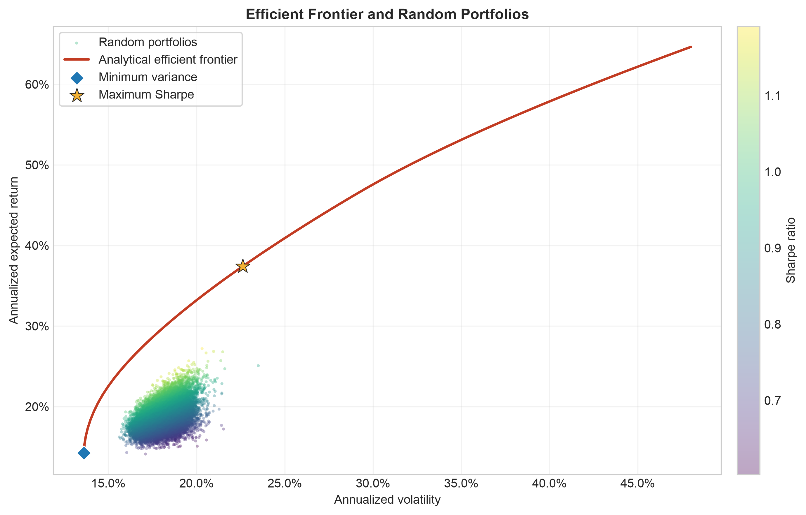
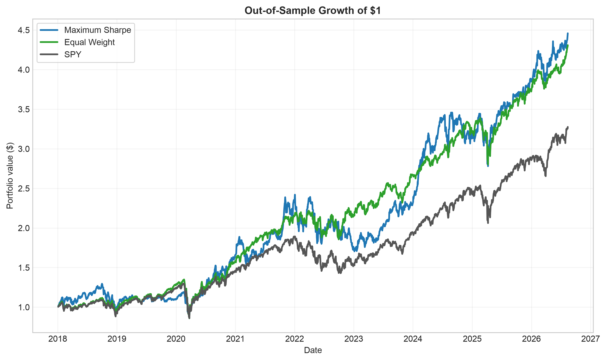
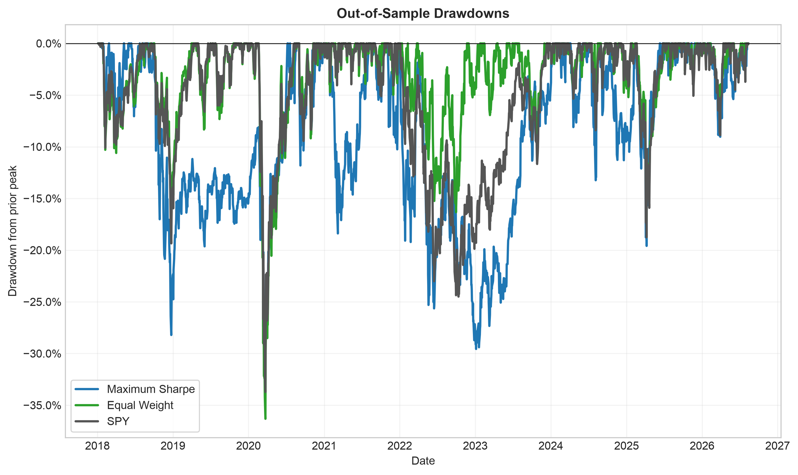
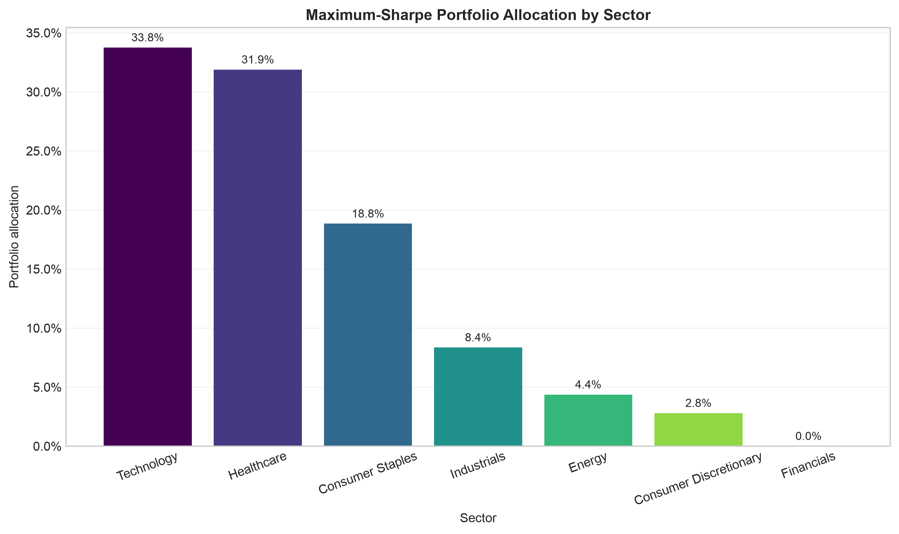

# Portfolio Optimization and Backtesting

This project uses real adjusted U.S. stock prices from Yahoo Finance to build and test long-only portfolios across 49 stocks and seven sectors. It estimates expected returns and covariance, solves minimum-variance and maximum-Sharpe portfolios, traces the efficient frontier, compares the analytical solution with 25,000 random portfolios, and evaluates the strategy in a strictly out-of-sample walk-forward backtest against equal-weight and SPY benchmarks.



## Results

The backtest covers **January 4, 2018 through August 13, 2026**. Each allocation uses only the previous 756 trading days, then remains invested for the next 63 trading days before rebalancing. The maximum-Sharpe strategy produced the highest CAGR in this sample, while the equal-weight benchmark produced the highest realized Sharpe ratio.

| Strategy | CAGR | Annualized volatility | Sharpe ratio | Maximum drawdown | Calmar ratio | Average turnover |
|---|---:|---:|---:|---:|---:|---:|
| Maximum Sharpe | 19.03% | 23.23% | 0.737 | -32.55% | 0.585 | 30.48% |
| Equal Weight | 18.56% | 18.92% | 0.837 | -36.32% | 0.511 | 4.74% |
| SPY | 14.83% | 19.12% | 0.663 | -33.72% | 0.440 | 0.00% |

These are historical results, not expected future returns. The machine-readable table is available at [`outputs/tables/performance_summary.csv`](outputs/tables/performance_summary.csv).







## Methodology

### Data

- Source: Yahoo Finance through `yfinance`
- Full estimation sample: January 2, 2015 through August 13, 2026
- Assets: 49 large U.S. stocks, grouped into Technology, Financials, Healthcare, Consumer Discretionary, Energy, Industrials, and Consumer Staples
- Benchmark: SPY
- Price series: daily adjusted close (`auto_adjust=True`), which accounts for splits and distributions
- Missing values: reported and removed by dropping affected dates; prices are never filled or fabricated
- Returns: daily simple returns with 252 trading days per year

The ticker universe and every model setting are stored in [`config.yaml`](config.yaml).

### Risk and optimization

- Expected returns use annualized historical arithmetic means.
- Both sample covariance and Ledoit-Wolf shrinkage covariance are estimated and validated.
- Ledoit-Wolf covariance is used by the optimizer to reduce estimation noise.
- SLSQP solves the global minimum-variance, maximum-Sharpe, and target-return problems.
- Portfolios are long-only, fully invested, and bounded between 0% and 100% per asset.
- The model uses a constant 3% annual risk-free rate and no sector cap.
- The efficient frontier contains 50 target-return portfolios from the global minimum-variance return through the highest individual estimated asset return.
- A reproducible Monte Carlo simulation generates 25,000 Dirichlet-weighted portfolios with random seed 42. None crosses the analytical frontier.

### Walk-forward backtest

At each rebalance, the strategy estimates expected returns and Ledoit-Wolf covariance from exactly the previous **756 trading days**. It then calculates maximum-Sharpe weights and applies them only to the following **63 trading days**. Assets drift naturally during each holding period instead of being reset to target weights every day.

This separation is what prevents look-ahead bias:

1. The training window ends on the trading day before the holding window begins.
2. No return from a holding window is used to choose that window's weights.
3. The rebalance log checks this date ordering for all 35 periods.
4. The automated test independently rebuilds the first allocation using only its recorded training dates and verifies that the weights match.

The equal-weight benchmark follows the same quarterly holding schedule across the same 49 stocks. SPY is held over the identical out-of-sample dates. Transaction costs are configured at 0 basis points, and reported turnover is average one-way turnover per scheduled rebalance with the initial funding trade excluded.

## Repository structure

```text
portfolio-optimization-project/
├── config.yaml
├── run_all.py
├── requirements.txt
├── src/
│   ├── data.py
│   ├── returns.py
│   ├── covariance.py
│   ├── optimize.py
│   ├── frontier.py
│   ├── montecarlo.py
│   ├── backtest.py
│   ├── metrics.py
│   └── plots.py
├── tests/
│   └── test_math.py
└── outputs/
    ├── figures/
    └── tables/
```

## Reproduce the project

Python 3.10 or newer and Git are required.

```bash
git clone https://github.com/SachitCharan/portfolio-optimization-project.git
cd portfolio-optimization-project
python3 -m venv .venv
source .venv/bin/activate
python3 -m pip install -r requirements.txt
python run_all.py
```

The first run downloads real market data and stores it locally in `data/adjusted_close_prices.csv`. The data file is intentionally excluded from Git because it can be recreated from Yahoo Finance. Later runs use the cache until it reaches the configured maximum age.

Run the automated validation suite with:

```bash
python -m pytest -q
```

## Limitations

- Historical average returns are noisy and weak predictors of future returns, so optimized weights can change sharply when the sample changes.
- The universe uses a fixed present-day list of large stocks over the historical period, which introduces survivorship and selection bias.
- Transaction costs, taxes, bid-ask spreads, slippage, and market impact are set to zero in the reported results.
- No sector cap is imposed. The optimizer can produce concentrated sector or individual-stock exposures, as the sector chart demonstrates.
- Results depend on the selected dates, assets, risk-free rate, rebalance schedule, and Yahoo Finance data quality or revisions.
- Ledoit-Wolf shrinkage improves covariance stability but does not remove expected-return estimation error or guarantee strong out-of-sample performance.

This repository is an educational research project and is not investment advice.

## License

Released under the [MIT License](LICENSE).
